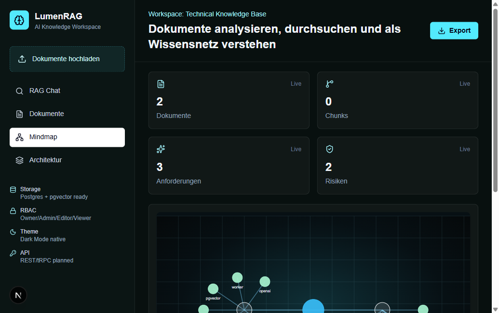

# LumenRAG

LumenRAG is a modern open-source RAG knowledge workspace for technical documents, requirements, architecture knowledge and source-grounded AI search.

It is inspired by graph-based RAG architectures, but implemented as a TypeScript-first product with a clean path to PostgreSQL, pgvector, workers and OpenAI streaming.

## Preview



## Current MVP

- Next.js + TypeScript + Tailwind
- Document upload for text-like files, PDFs and DOCX files
- Chunking
- Keyword/semantic-style search
- Source-grounded answer generation
- Streaming chat UI with citations, stop control, source-only mode and DB-backed conversation history
- Document detail view with source chunks, citation links, match highlighting and Markdown/code/table preview
- Worker-based ingestion queue with progress, retry and cancellation when PostgreSQL and Redis are enabled
- Document classification
- Requirement extraction
- Risk extraction
- Automatic tags
- Interactive mindmap from uploaded documents
- Browser-local workspace autosave
- Optional PostgreSQL workspace persistence through Prisma
- PostgreSQL full-text retrieval with optional OpenAI embeddings and pgvector hybrid search
- Workspace import/export as JSON
- API routes for upload, search, chat, graph, stream, export and workspace storage
- Prisma schema and migration for PostgreSQL + pgvector
- Docker Compose for PostgreSQL, Redis and MinIO

## Development

```bash
npm install
npm run dev
```

Open `http://localhost:3000`.

## Docker Quickstart

From a fresh clone with Docker Desktop or Docker Engine running:

```bash
docker compose up --build
```

Open `http://localhost:3000`.

This starts the Next.js app, PostgreSQL with `pgvector`, Redis and MinIO. The compose stack also runs `prisma migrate deploy` before the app starts, so the database schema is created automatically.
The ingestion worker is started by Compose as well. Uploads return queued jobs quickly, while parsing, chunking, extraction, persistence and optional embeddings run in the worker.

To load the demo workspace into the running Docker database:

```bash
docker compose run --rm migrate npm run seed:demo
```

OpenAI is optional. Without `OPENAI_API_KEY`, LumenRAG uses the local deterministic answer generator and no chat prompts are sent to OpenAI. To enable OpenAI-backed answers, create `.env` from `.env.example` and set `OPENAI_API_KEY` before starting the stack.

## Optional PostgreSQL Persistence

The app works without a database and falls back to browser-local autosave. To enable server-side persistence:

```bash
cp .env.example .env
docker compose up -d postgres
npm run db:generate
npm run db:migrate
npm run dev
```

The UI status panel shows `DB Autosave` when `/api/workspace` can read and write through Prisma. If the database is unavailable, the app automatically falls back to `Browser Autosave`.

To seed the database with a small demo workspace:

```bash
npm run seed:demo
```

## Optional OpenAI Mode

Create `.env` from `.env.example` and set:

```bash
OPENAI_API_KEY="..."
```

When the key is present, `/api/chat` uses OpenAI for grounded answer generation. Without a key, the app falls back to the local deterministic answer generator.

When PostgreSQL is enabled, uploaded documents and chunks are persisted through Prisma. If `OPENAI_API_KEY` is configured, LumenRAG stores `text-embedding-3-small` embeddings in pgvector and `/api/search` uses hybrid vector plus full-text retrieval. Without an embedding provider, search falls back to PostgreSQL full-text and then to local heuristic retrieval.

The chat UI uses `/api/chat/stream` for live token streaming. Citations are shown during generation, responses can be stopped, and conversations are persisted when PostgreSQL is enabled.

## Supported Uploads

The current parser supports:

- `.txt`, `.md`, `.csv`, `.json`, `.log`, `.xml`, `.yaml`, `.yml`
- source files such as `.ts`, `.tsx`, `.js`, `.py`, `.java`, `.cs`
- `.pdf`
- `.docx`

## Production Architecture

See:

- `docs/architecture.md`
- `docs/api.md`
- `prisma/schema.prisma`

## License

LumenRAG is released under the [MIT License](LICENSE).

## Next Implementation Steps

1. Move ingestion from API request handling to worker jobs.
2. Add OpenAI embeddings using `text-embedding-3-small`.
3. Add pgvector retrieval queries over persisted chunks.
4. Wire `/api/chat/stream` into the chat UI.
5. Add Auth.js or OIDC.
6. Add role-based access checks for organization and workspace scope.
7. Add source-span highlighting in document preview.
